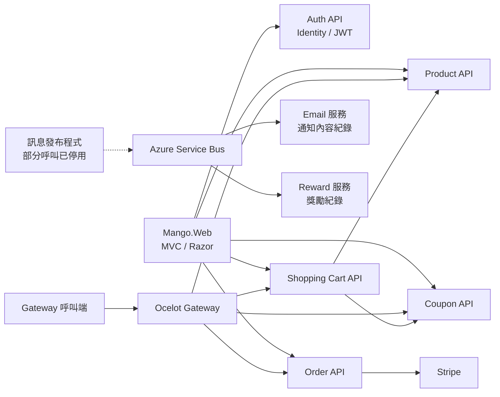

# Mango｜.NET 多服務電商練習專案

Mango 是以電商情境為主題的 ASP.NET Core 練習專案，涵蓋會員、商品、優惠券、購物車與訂單流程，並包含 API Gateway、Stripe 付款串接與 Azure Service Bus 訊息處理實作。

本專案的學習重點，是將不同業務功能拆分為獨立服務，練習 API 溝通、身分驗證、資料存取，以及外部服務整合。此儲存庫保留學習階段的程式與設定；目前部分訊息流程已停用，重現環境前需依下方說明調整。

## 功能與實作範圍

| 模組 | 實作內容 |
| --- | --- |
| 會員驗證 | 註冊、登入、角色指派，使用 ASP.NET Core Identity 與 JWT |
| 商品 | 商品查詢與管理、商品圖片相關處理 |
| 優惠券 | 優惠券管理、依代碼查詢與購物車折扣計算 |
| 購物車 | 商品加入與數量更新、移除商品、套用優惠券，串接商品與優惠券 API |
| 訂單 | 建立及查詢訂單、更新狀態，包含 Stripe Checkout、付款狀態查詢與退款程式 |
| API Gateway | 以 Ocelot 設定路由轉送，部分路由要求 Bearer Token |
| 訊息處理 | Azure Service Bus Queue 與 Topic／Subscription 的發布、消費程式 |
| 通知與獎勵 | 通知內容寫入資料庫、訂單獎勵紀錄；實際寄信尚未實作 |
| Web 前端 | ASP.NET Core MVC／Razor Views，透過 HTTP 呼叫後端服務 |

以上為程式實作範圍；外部服務可用性與完整流程仍需在設定環境後驗證。

## 技術組成

- **後端**：C#、.NET 8、ASP.NET Core Web API
- **前端**：ASP.NET Core MVC、Razor Views、Bootstrap
- **資料存取**：Entity Framework Core、SQL Server、Migrations
- **身分驗證**：ASP.NET Core Identity、JWT Bearer；Web 前端使用 Cookie Authentication
- **服務溝通**：HttpClient、Ocelot API Gateway、Azure Service Bus
- **外部整合**：Stripe
- **其他工具**：AutoMapper、Swagger／OpenAPI、Serilog

> Web 與 API 專案以 `net8.0` 為目標；共用的 `Mango.MessageBus` 目前使用舊式 .NET Framework 4.7.2 專案格式，完整建置前需處理跨框架相容性。

## 架構概覽

目前 Web 前端的設定直接指向各個 API；Ocelot Gateway 為另一條路由整合路徑，尚未設定為前端唯一入口。Email 與 Reward 服務透過 Service Bus 消費訊息。



各 API／訊息消費服務具有自己的 DbContext 與 Migration，以 SQL Server 保存所需資料。

## 專案結構

| 目錄 | 用途 |
| --- | --- |
| `Mango.Web` | Web 介面與 API 呼叫服務 |
| `Mango.GatewaySolution` | Ocelot 路由及 Gateway 驗證設定 |
| `Mango.Service.AuthAPI` | 帳號、角色與 JWT |
| `Mango.Services.ProductAPI` | 商品服務 |
| `Mango.Services.CouponAPI` | 優惠券服務 |
| `Mango.Service.ShoppingCartAPI` | 購物車與跨 API 整合 |
| `Mango.Services.OrderAPI` | 訂單與 Stripe 串接 |
| `Mango.Service.EmailAPI` | 訊息消費與通知內容紀錄 |
| `Mango.Services.RewardAPI` | 訊息消費與獎勵紀錄 |
| `Mango.MessageBus` | 共用訊息發布介面與實作 |
| `Mango.sln` | Visual Studio 方案 |

## 本機環境準備

### 1. 取得專案

預設分支名稱為 `Mango`。

```bash
git clone --branch Mango https://github.com/YuAnn0715/Mango.git
cd Mango
```

準備 .NET 8 SDK、SQL Server，以及可開啟 .NET 8 專案的 Visual Studio 或開發工具。

目前 MessageBus 專案是 .NET Framework 4.7.2，並保留舊式參考。建置完整方案前，需先整理此專案及其參考；可考慮改為與呼叫端相容的 SDK 格式類別庫，再重新驗證。只安裝 .NET 8 SDK 尚不足以保證完整方案可建置。

### 2. 調整設定

依服務需求更新設定；密鑰與連線資訊建議透過環境變數或本機 Secret Manager 提供，不要提交真實憑證。

| 設定 | 說明 |
| --- | --- |
| `ConnectionStrings:DefaultConnection` | 各資料服務的 SQL Server 連線字串 |
| `ApiSettings:JwtOptions:Secret / Issuer / Audience` | Auth API 簽發 JWT 的設定 |
| `ApiSettings:Secret / Issuer / Audience` | 其他 API 與 Gateway 驗證 JWT 的設定，須與 Auth API 一致 |
| `ServiceUrls:*` | Web 與跨服務 HTTP 呼叫的目的位址 |
| `Stripe:SecretKey` | Order／Coupon 服務使用的 Stripe 金鑰；本機練習使用測試模式 |
| `ServiceBusConnectionString` | Email／Reward 消費服務的 Service Bus 連線資訊 |
| `TopicAndQueueNames:*` | Queue、Topic 與 Subscription 名稱 |

**訊息發布端另有設定方式：**目前 `Mango.MessageBus/MessageBus.cs` 將連線字串寫在程式內，尚未從上述設定讀取；使用前需改為讀取自己的設定。僅修改 `appsettings.json` 不會更新發布端連線。

Gateway 的 `ocelot.json` 目前指向 Azure 網域。本機使用 Gateway 時，需將 `DownstreamHostAndPorts` 改為 `localhost` 與對應服務的 Port，並更新 `GlobalConfiguration:BaseUrl`。

### 3. 資料庫

各資料服務啟動時會呼叫 EF Core Migration。請先確認 SQL Server 可連線，且帳號具有建立資料庫與套用 Migration 所需權限。

建議每個服務使用各自的練習資料庫，避免不同服務的資料表及 Migration 混用。

### 4. 啟動服務

完成建置相容性與設定調整後，可在 Visual Studio 設定多個啟始專案，或在不同終端機以 `https` profile 啟動。

例如：

```bash
dotnet run --project Mango.Services.ProductAPI/Mango.Services.ProductAPI.csproj --launch-profile https
```

以下位址取自目前各專案的 `launchSettings.json`：

| 專案 | HTTPS 位址 |
| --- | --- |
| Product API | `https://localhost:7000` |
| Coupon API | `https://localhost:7001` |
| Auth API | `https://localhost:7002` |
| Shopping Cart API | `https://localhost:7003` |
| Order API | `https://localhost:7004` |
| Gateway | `https://localhost:7777` |
| Email 服務 | `https://localhost:7241` |
| Reward 服務 | `https://localhost:7188` |
| Web | `https://localhost:7148` |

建議先啟動 Product、Coupon、Auth，再啟動 Cart、Order 與 Web。Gateway 可依測試需求另行啟動；Email／Reward 會在啟動時建立訊息消費程式，需先準備有效的 Service Bus 設定及資源。

各 API 在 Development 環境提供 `/swagger`。可先從商品查詢、註冊與登入開始，再逐步驗證購物車和訂單流程。Stripe 流程需要測試帳號與金鑰。

## 目前限制與待整理事項

- **建置相容性**：MessageBus 使用 .NET Framework 4.7.2，部分 NuGet 版本亦未統一；需先整理並驗證完整方案。
- **Azure 訊息流程**：註冊與付款成功後的訊息發布呼叫目前被註解；購物車訊息功能也標註為不可用。重新設定 Azure 資源後，仍需恢復並驗證對應程式。
- **通知功能**：Email 服務目前將訊息存入 `EmailLoggers`，沒有 SMTP 或郵件 API 寄送實作。
- **Gateway 設定**：保留 Azure 路由位址；Web 目前直接呼叫各 API。
- **流程驗證**：此儲存庫未包含自動化測試專案；完整付款、退款及訊息流程需在自己的環境確認。
- **後續改善方向**：整理設定管理、輸入驗證、錯誤回應、授權與資料歸屬檢查，以及加入關鍵流程測試。

## 學習重點

- 以不同業務責任拆分服務，理解服務間的依賴與溝通方式。
- 使用 DTO、AutoMapper、EF Core 與 Migration 建立資料存取流程。
- 練習 Identity、JWT 與前端 Cookie 驗證的整合。
- 串接第三方付款與非同步訊息服務，理解外部依賴對流程的影響。

本專案作為 .NET 後端及服務整合的學習紀錄，保留實作內容與目前限制，供程式閱讀及後續延伸。

